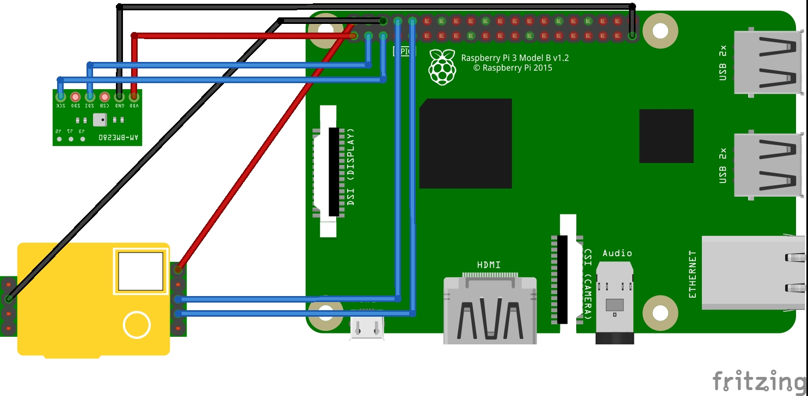

# mhz-19-bme280

# How to move

1. Using RaspberryPi, mh-z19 and BME280
2. Enable Uart and I2C
3. Connect sensor



```sh
$ make build
$ sudo ./main
```


```sh
$ curl raspberrypi.local:8080 | jq
{
  "co_2": 436,
  "pressure": 1013,
  "humidity": 46.671875,
  "temputure": 28.92,
  "date": "2020-08-03T10:15:29.910870521+09:00"
}
```

